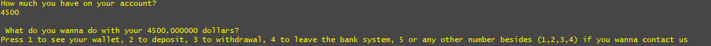
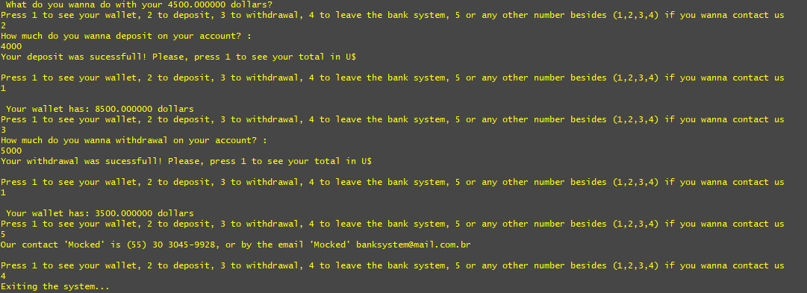

<h2>Technologies: </h2>

Visual Studio Code

Golang

<h2>The Bank Menu:</h2>
<h4>Main menu</h4>

<h4>Financial Operations</h4>

<h5>If you want to try the project, just clone and open a terminal, and -> go run main.go</h5>